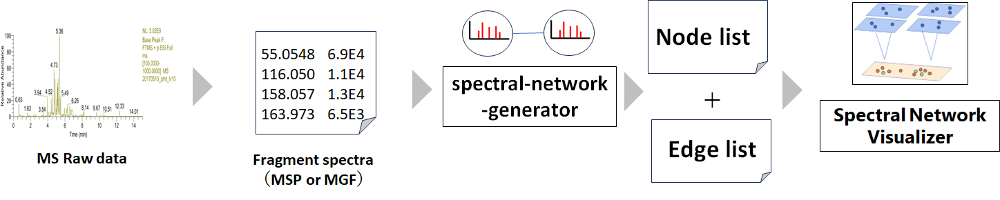

# SNVis

This repository is for the project "Spectral Network Visualizer" and related resource.
 
[simple tutorial (Japanese))](tutorial20230925.pdf)

 
You can download spectral network vizualizer (docker container to visualize spectral network) 
from the dedicated repository [here](https://github.com/kanakohirata/spectral-network-visualizer)
 
 
For processing task to create a source data of mass spectral molecular network, you have two options.  
1(RECOMMENDED): Use [the dedicated script](https://github.com/kanakohirata/spectral-network-generator) 
2: Use MS data analysis software capable of processing spectral simliarity, (such as MS-DIAL) and edit the edge and node list so they are compatible with Spectral Network Visualizer

